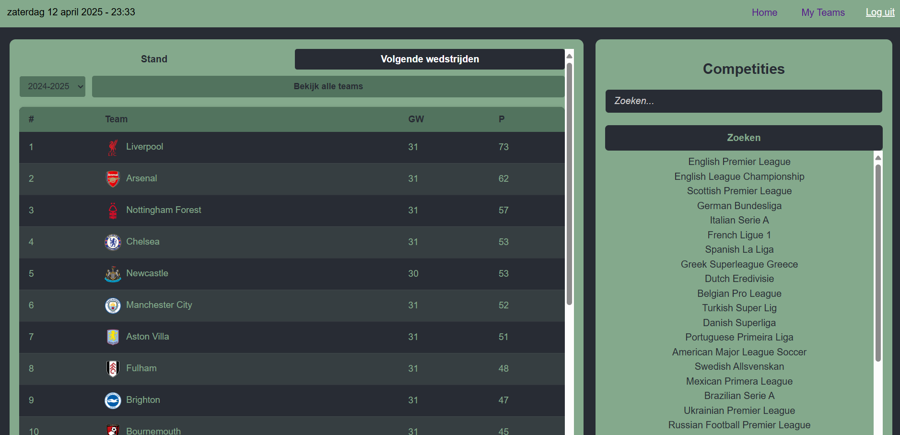

# ⚽ SportData App

Volg jouw favoriete voetbalteams — altijd en overal. Deze React-applicatie maakt gebruik van [TheSportsDB API](https://www.thesportsdb.com) om live data op te halen zoals teaminformatie, wedstrijden en standen.


.png)
.png)

---

## 📦 Benodigdheden

- Node.js (v16 of hoger)
- NPM of Yarn
- IDE zoals WebStorm of VS Code

---

## 🚀 Installatie

1. **Kloon de repository**
   ```bash
   git clone https://github.com/jouw-gebruikersnaam/sport-data-app.git
   ```

2. **Ga naar de map**
   ```bash
   cd sport-data-app
   ```

3. **Installeer de dependencies**
   ```bash
   npm install
   ```

4. **Start de applicatie**
   ```bash
   npm start
   ```

De app draait nu op `http://localhost:3000`.

---

## 👥 Testgebruikers

| Gebruikersnaam  | Wachtwoord |
|-----------------|------------|
| `gebruiker2025` | `test1234` |
| `fan2025`       | `voetbal!` |

Deze gebruikers kun je gebruiken om de applicatie te testen.

---

## 🧩 Gebruikte technologieën

- React (met `useState`, `useEffect`, routing via React Router)
- TheSportsDB API
- Custom styling met CSS
- LocalStorage voor favorieten teams
- JWT-authenticatie

---

## 💡 Overige scripts

| Commando         | Omschrijving                       |
|------------------|------------------------------------|
| `npm run build`  | Bouw een productieversie van de app |
| `npm run lint`   | Voer een linter uit (indien ingesteld) |
| `npm test`       | Voer eventuele tests uit           |

---

## 📂 Structuur

```
src/
├── Components/
│   ├── Auth/
│   ├── Events/
│   ├── Footer/
│   ├── Home/
│   ├── Leagues/
│   ├── NavBar/
│   ├── SearchBar/
│   ├── Teams/
├── App.js
├── index.js
```

---
🔑 API-sleutel instellen (TheSportsDB)
Deze app gebruikt de TheSportsDB API om teaminformatie, wedstrijden en standen op te halen. Hiervoor heb je een (gratis) API key nodig.

📌 Zo stel je de API-sleutel in:
Ga naar https://www.thesportsdb.com

1. Maak een account aan of log in

2. Kopieer jouw persoonlijke API Key vanaf je profielpagina

3. Maak in de root van je project een .env bestand aan (indien nog niet aanwezig)

4. Voeg deze regel toe aan dat bestand:
env:
REACT_APP_SPORTS_API_KEY=jouweigenapikeyhier

5. Sla op en (her)start je app met:
npm start
6. De API key wordt in de code gebruikt via:
const API_KEY = process.env.REACT_APP_SPORTS_API_KEY;

7. Let op: commit je .env bestand nooit mee naar GitHub. Dit bestand staat al in .gitignore, dus dat zit goed!

> Gemaakt als **Eindopdracht Frontend** Novi Hogeschool.