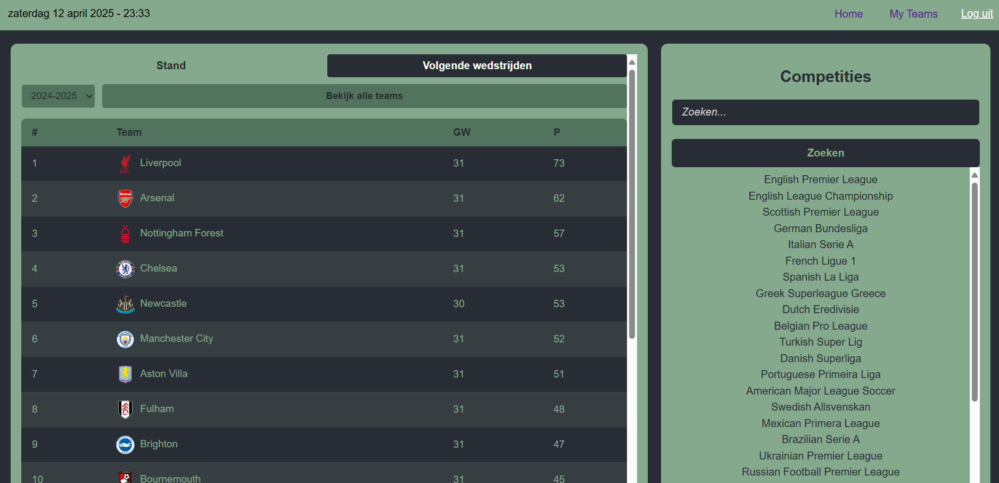

# ⚽ SportData App

Volg jouw favoriete voetbalteams — altijd en overal. Deze React-applicatie maakt gebruik van [TheSportsDB API](https://www.thesportsdb.com) om live data op te halen zoals teaminformatie, wedstrijden en standen.


.png)
.png)

---

## 📦 Benodigdheden

- Node.js (v16 of hoger)
- NPM of Yarn
- IDE zoals WebStorm of VS Code

---

## 🚀 Installatie

1. **Kloon de repository**
   ```bash
   git clone https://github.com/jouw-gebruikersnaam/sport-data-app.git
   ```

2. **Ga naar de map**
   ```bash
   cd sport-data-app
   ```

3. **Installeer de dependencies**
   ```bash
   npm install
   ```

4. **Start de applicatie**
   ```bash
   npm start
   ```

De app draait nu op `http://localhost:3000`.

---

## 👥 Testgebruikers

| E-mail                      | Wachtwoord |
|-----------------------------|------------|
| `gebruiker2025@hotmail.com` | `test1234` |
| `fan2025@hotmail.com`       | `voetbal!` |

Deze gebruikers kun je gebruiken om de applicatie te testen.

---

## 🧩 Gebruikte technologieën

- React (met `useState`, `useEffect`, routing via React Router)
- TheSportsDB API
- Custom styling met CSS
- LocalStorage voor favorieten teams
- JWT-authenticatie

---
🌐 Fetchstrategie

Voor het ophalen van alle competities (all_leagues.php) wordt gebruikgemaakt van een CORS-proxy via AllOrigins vanwege CORS-beperkingen op deze specifieke endpoint.

Andere API-aanroepen verlopen rechtstreeks via TheSportsDB API.

## 💡 Overige scripts

| Commando         | Omschrijving                       |
|------------------|------------------------------------|
| `npm run build`  | Bouw een productieversie van de app |
| `npm run lint`   | Voer een linter uit (indien ingesteld) |
| `npm test`       | Voer eventuele tests uit           |

---

## 📂 Structuur

```
src/
├── Components/
│   ├── Auth/
│   ├── Events/
│   ├── Footer/
│   ├── Home/
│   ├── Leagues/
│   ├── NavBar/
│   ├── SearchBar/
│   ├── Teams/
├── App.js
├── index.js
```


> Gemaakt als **Eindopdracht Frontend** Novi Hogeschool.